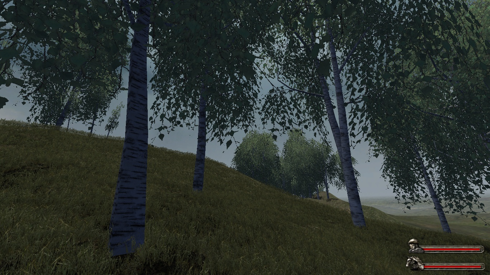

# Gekokujo Vanilla Enhanced (GVE)
A submod for Mount and Blade Warband mod Gekokujo, based on version 3.0
### Please post an issue if I have misused any assets, they all are originally from the mod itself as well as my own original ones.

This projct is not being developd right now, but its aim was to polish and improve the most stable Gekokujo mod version 3.0, 
while retaining the original flavor of it. 
Another feature was to make both DirectX9 and DirectX7 modes visually appealing by tweaking the shaders while editing assets. 
So far I've mostly focused on vegetation and map border assets, as well as tweaked a few scenes, see files for more info.

Link to the Gekokujo mod: https://www.moddb.com/mods/gekokujo

Link to the Gekokujo forum section: https://forums.taleworlds.com/index.php?forums/gekokujo-s.361/

## You will need to install the original Gekokujo 3.0 version mod and then replace the files in the module with GVE ones.

## Save compatibility may not be guaranteed at this point and will most likely not be available in the future development.
## Demos
DirectX7 demo: https://www.youtube.com/watch?v=BkxBoHyhDeg

DirectX9 demo: https://www.youtube.com/watch?v=WuOPDWSdr5o

